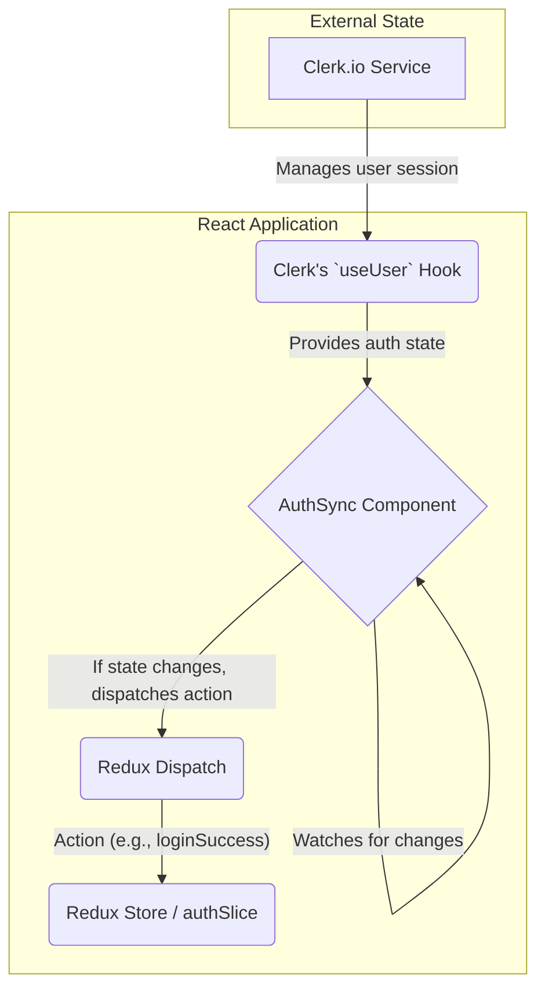
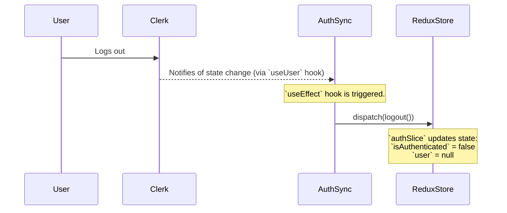

# Explaining `AuthSync.jsx`: The Bridge Between Clerk and Redux

This document explains the purpose and workflow of the `AuthSync.jsx` component. Its sole responsibility is to synchronize the authentication state from the external Clerk.io service with the application's internal Redux state.

## 1. The Problem: Two Sources of Truth

In this application, we have two sources of truth for user authentication:

1.  **Clerk (`@clerk/clerk-react`)**: An external service that handles the entire authentication lifecycle (sign-in, sign-up, session management). It exposes the user's status through its own hooks (like `useUser`).
2.  **Redux Store (`authSlice`)**: The application's internal state container. Other components (like `CommunityDashboard`) rely on this store to get information about the current user and their permissions.

Without a synchronizer, the Redux store would have no idea if a user has logged in or out via Clerk. `AuthSync.jsx` solves this by acting as a bridge.

## 2. How It Works

`AuthSync` is a **headless component**—it doesn't render any UI. It is placed at the top level of the component tree (in `main.jsx`) so it is always active.

It continuously monitors the Clerk authentication state and dispatches actions to the Redux store to ensure the two are always in sync.

### Architecture Diagram

This diagram shows the flow of data from Clerk to the Redux store via the `AuthSync` component.



## 3. Step-by-Step Workflow (Sequence Diagram)

This diagram illustrates the sequence of events during a login and logout flow.

### Login Flow

When a user successfully logs in using a Clerk component:



### Logout Flow

When a user logs out:


## 4. Code Breakdown

```javascript
import { useEffect } from "react";
import { useDispatch } from "react-redux";
import { useUser } from "@clerk/clerk-react";
import { loginSuccess, logout } from "./features/auth/authSlice";

export default function AuthSync() {
  // 1. Get the Redux dispatch function
  const dispatch = useDispatch();

  // 2. Get the real-time auth state from Clerk
  const { isSignedIn, user } = useUser();

  // 3. Use useEffect to react to changes in Clerk's state
  useEffect(() => {
    // 4. If the user is signed in...
    if (isSignedIn && user) {
      // Normalize the user object to a simpler format
      const userData = {
        id: user.id,
        name: user.fullName,
        email: user.primaryEmailAddress?.emailAddress,
        username: user.username,
        imageUrl: user.imageUrl,
      };
      // ...dispatch the loginSuccess action to Redux
      dispatch(loginSuccess(userData));
    } else {
      // 5. Otherwise, the user is signed out...
      // ...so dispatch the logout action to Redux
      dispatch(logout());
    }
  }, [isSignedIn, user, dispatch]); // Dependency array ensures this runs only when auth state changes

  // 6. This component renders nothing to the UI
  return null;
}
```

By implementing this pattern, the rest of the application can rely solely on the Redux store for authentication information, creating a clean and predictable architecture.
