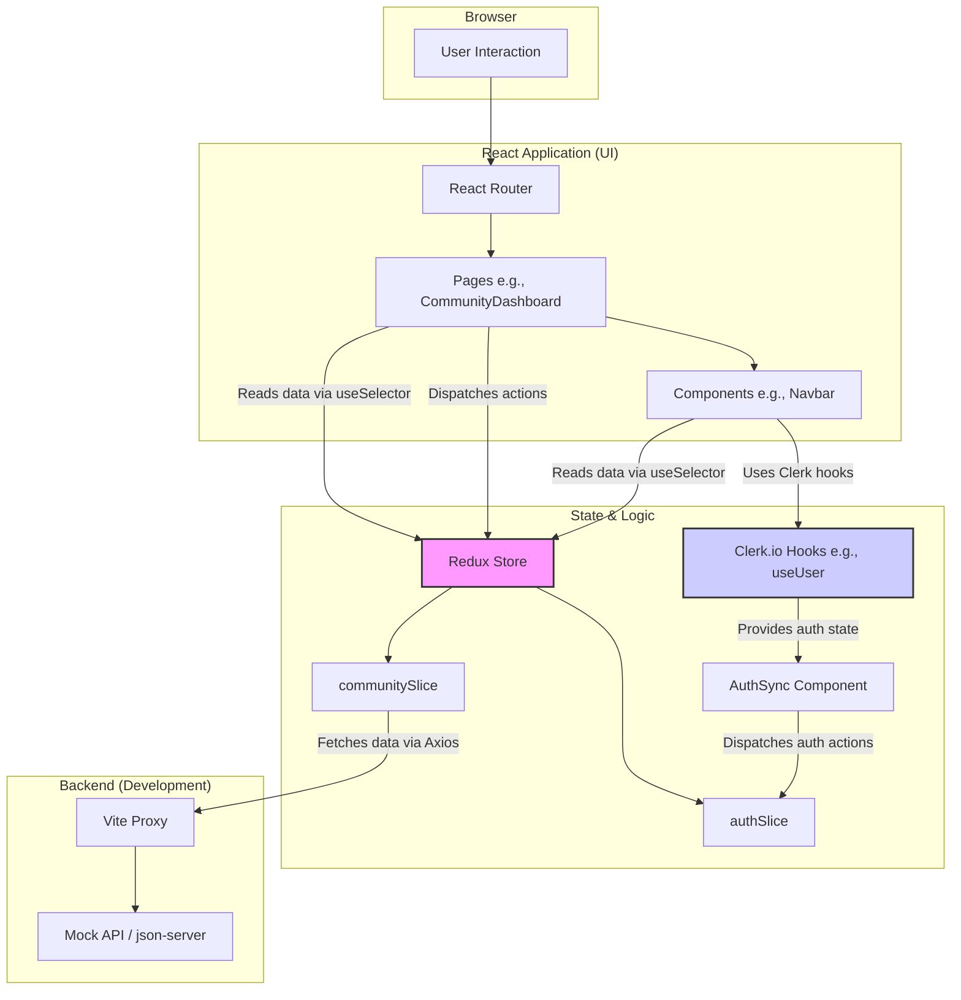
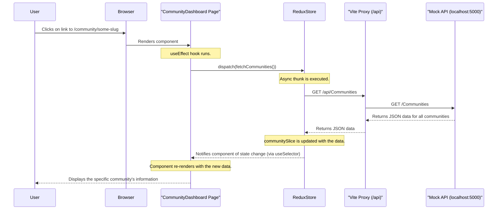

# Project Overview: ThriveCircle

This document provides a comprehensive overview of the ThriveCircle React application, its architecture, and the role of each file and folder.

## 1. High-Level Summary

ThriveCircle is a web application designed to help users discover, manage, and monetize offline communities. It provides features for users to find local events and communities, and for community builders to create and manage their own "ThriveCircles."

The project is built using a modern frontend stack:

-   **Framework**: React (v19) with Vite for a fast development experience.
-   **Language**: JavaScript (ESM).
-   **Styling**: Tailwind CSS for utility-first styling.
-   **Routing**: `react-router-dom` for client-side navigation.
-   **State Management**: Redux Toolkit for predictable global state management.
-   **Authentication**: `@clerk/clerk-react` for user authentication and management.
-   **API Communication**: `axios` for making HTTP requests to the backend.
-   **Mock API**: `json-server` to provide a mock backend for development, serving data from `mock-api/db.json`.

## 2. Project Structure

The folder structure is organized to separate concerns, making the codebase modular and maintainable.

```
C:\Code\React_project\
├───.env.local         # Local environment variables (e.g., API keys)
├───.gitignore         # Files and folders to be ignored by Git
├───eslint.config.js   # ESLint configuration for code linting
├───index.html         # The main HTML entry point for the Vite app
├───package.json       # Project metadata, dependencies, and scripts
├───vite.config.js     # Vite build and server configuration
├───mock-api\
│   └───db.json        # Mock database for json-server
├───public\             # Static assets that are publicly accessible
└───src\
    ├───App.jsx          # The root React component with routing definitions
    ├───main.jsx         # The entry point of the React application
    ├───api\            # Axios configuration for API calls                                                                      │
    ├───assets\          # Images, icons, and other static assets                                                                │
    ├───components\      # Reusable UI components                                                                                │
    ├───pages\           # Top-level components for each application route/page                                                  │
    ├───reduxTK\         # Redux Toolkit state management (store, slices)                                                        │
    └───utils\           # Utility functions used across the application        
```

## 3. Key Files and Directories

### 3.1. Root Directory

-   **`package.json`**: Defines the project's dependencies (`react`, `redux`, `tailwindcss`, etc.) and scripts. The `dev` script is notable as it uses `concurrently` to run both the Vite development server and the mock API server at the same time.
-   **`vite.config.js`**: Configures the Vite development server. It sets the server port to `3000` and, crucially, proxies any requests made to `/api` to the mock API server running on `http://localhost:5000`. This allows the frontend code to make API calls to a relative path (`/api/Communities`) without worrying about the mock server's port.
-   **`index.html`**: The main HTML file where the React application is mounted to the `<div id="root"></div>` element.

### 3.2. `mock-api/`

-   **`db.json`**: A simple JSON file that acts as a database for the `json-server`. It contains mock data for `Events`, `Communities`, and `categories`, which allows for rapid frontend development without a live backend.

### 3.3. `src/` - The Application Core

This directory contains all the source code for the React application.

-   **`main.jsx`**: The application's entry point. It performs several critical initializations:
    1.  Wraps the entire app in a Redux `<Provider>` to make the global state available.
    2.  Wraps the app in Clerk's `<ClerkProvider>` to provide authentication context.
    3.  Wraps the app in `<BrowserRouter>` to enable client-side routing.
    4.  Renders the main `App` component into the DOM.

-   **`App.jsx`**: The root component of the application. Its primary responsibility is to define the application's routes using `react-router-dom`. It maps URL paths like `/`, `/discover`, and `/community/:slug` to their corresponding page components from the `src/pages/` directory.

#### `src/api/`

-   **`index.js`**: This file creates and exports a pre-configured `axios` instance. By setting `baseURL: "/api"`, it ensures that all API calls made with this instance are automatically directed to the Vite proxy, simplifying data fetching logic in components.

#### `src/components/`

This folder contains reusable UI components used across various pages.

-   **`Navbar/`**: The main navigation bar for the application. It displays navigation links, a search bar, and handles user authentication status (showing a "Sign In" link or a user profile dropdown if logged in via Clerk).
-   **`CommunityCards/`**: A key component that fetches the list of communities from the `/api/Communities` endpoint and displays them in a grid format. It demonstrates data fetching with the configured `axios` instance.
-   **`Footer/`**: The application's footer.
-   **Other Components**: The directory contains many other specialized components for forms, modals, and UI elements seen on the homepage, demonstrating a component-based architecture.

#### `src/pages/`

These are the main views of the application, each corresponding to a specific route.

-   **`Home/`**: The landing page of the application. It's composed of several sections, including a `HeroSection` and `FeaturesPreview`, and uses components from `src/components/`.
-   **`DiscoverPage/`**: A page for users to find communities and events. It composes the `Navbar`, `DiscoverEvents`, and `CommunityCards` components.
-   **`SignInPage/` & `SignUpPage/`**: Pages dedicated to user authentication, likely leveraging components provided by Clerk.
-   **`CreateCommunityPage/`**: A form-based page that allows authenticated users to create a new community.
-   **`CommunityDahsboard/`**: A page to display the details and management options for a specific community, identified by a `slug` in the URL.

#### `src/utils/`

This directory contains helper functions that can be reused throughout the application.

-   **`slugify/`**: Contains utility functions `slugify` and `deslugify` to convert strings into URL-friendly formats and back. This is used for creating clean URLs for community pages (e.g., `/community/mumbai-street-food-explorers`).

## 4. In-Depth: State Management with Redux Toolkit (`src/reduxTK/`)

This directory is the heart of the application's global state management, using Redux Toolkit to provide a centralized, predictable, and efficient state container.

### 4.1. Core Files

-   **`store.jsx`**: This file configures and creates the single source of truth for the application's state. It uses `configureStore` from Redux Toolkit to combine the reducers from the different feature slices (`auth` and `communities`).

-   **`AuthSync.jsx`**: This is a critical component that acts as a **bridge** between the external Clerk authentication library and the internal Redux state. It's a headless component (it renders `null`) whose only job is to:
    1.  Use the `useUser` hook from Clerk to get the current authentication status (`isSignedIn`, `user`).
    2.  Use a `useEffect` hook to watch for changes in the Clerk user.
    3.  If the user is signed in, it dispatches the `loginSuccess` action with a normalized user object to the Redux store.
    4.  If the user is signed out, it dispatches the `logout` action.
    This ensures that the application's internal state always reflects the authentication status provided by Clerk.

### 4.2. Feature Slices (`src/reduxTK/features/`)

Redux Toolkit encourages organizing state by "slices," where each slice corresponds to a specific feature.

#### `auth/authSlice.jsx`

-   **Purpose**: Manages all state related to user authentication.
-   **State**: Holds `user` data (ID, name, email), an `isAuthenticated` boolean, and `loading`/`error` flags.
-   **Reducers**: Contains standard reducers like `loginSuccess` and `logout` that are dispatched by the `AuthSync` component to directly change the state.

#### `community/communitySlice.jsx`

-   **Purpose**: Manages all state related to community data.
-   **State**: Holds an `items` array for all communities, plus `loading` and `error` flags for data fetching.
-   **Async Thunks**: It defines `fetchCommunities` using `createAsyncThunk`. This is the standard Redux Toolkit way to handle asynchronous actions. When dispatched, it makes an API call to fetch all communities and then dispatches `pending`, `fulfilled`, or `rejected` actions, which are handled by the `extraReducers`.
-   **Reducers**: Contains synchronous reducers for CRUD operations like `addCommunity`, `removeCommunity`, and `updateCommunity`.
-   **Selectors**: Exports memoized selector functions like `selectUserCommunities`. Selectors are a powerful pattern for deriving data from the state. Instead of components filtering the full list of communities themselves, they can use a selector, which improves performance and reusability.

### 4.3. Usage in Practice: The `CommunityDashboard`

The `src/pages/CommunityDahsboard/` provides a perfect example of how the Redux store is used:

1.  **Dispatching Actions**: In `CommunityDashboard/index.jsx`, a `useEffect` hook dispatches the `fetchCommunities()` action when the component first loads. This triggers the async thunk in the community slice to fetch the latest community data from the API.

    ```javascript
    // In CommunityDashboard/index.jsx
    useEffect(() => {
      dispatch(fetchCommunities());
    }, [dispatch]);
    ```

2.  **Subscribing to State with `useSelector`**: The custom hook `useCommunityDashboard` uses the `useSelector` hook to subscribe to the store and retrieve the latest state from both slices:

    ```javascript
    // In hooks/index.jsx
    const { items: communities = [] } = useSelector((state) => state.communities);
    const currentUser = useSelector((state) => state.auth?.user);
    ```

3.  **Combining State for UI Logic**: The hook then uses the `currentUser` from the `auth` slice and the list of `communities` to perform business logic, such as finding the specific community for the current page and checking if the `currentUser` has permission to edit it (`checkCreatorPermissions`).

This demonstrates the power of Redux: the `CommunityDashboard` doesn't need to know *how* the user was authenticated or *how* the communities were fetched. It simply dispatches an action to request data and selects the data it needs from the central store, allowing for a clean separation of concerns.

## 5. Visual Architecture (Mermaid Diagrams)

### 5.1. High-Level Architecture

This diagram shows how the main parts of the application interact. The user interacts with the UI (Pages and Components), which in turn read and update state from the Redux Store. The store fetches data from the mock backend, and the `AuthSync` component keeps the `authSlice` synchronized with Clerk.



### 5.2. Data Request Flow (Community Dashboard Example)

This sequence diagram illustrates the step-by-step process of a user navigating to the Community Dashboard page and how the required data is fetched and displayed.


